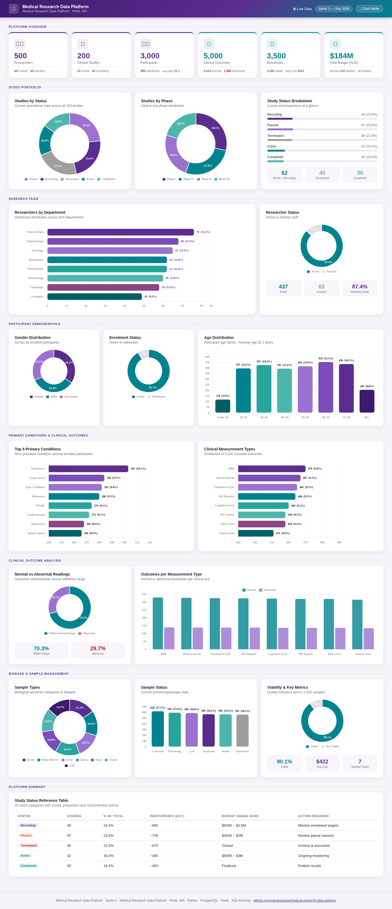

# 🧬 Medical Research Data Platform

[](https://python.org)
[](https://flask.palletsprojects.com)
[](https://postgresql.org)
[](https://docker.com)
[](https://pandas.pydata.org)
[](tests/)

> **BA Portfolio Project** — End-to-end clinical data platform for medical research — Perth, WA.
> Demonstrating how a Business Analyst translates stakeholder needs into technical delivery: from requirements gathering and User Stories through ETL, database design, REST API, and an analytics dashboard.

---

## 📊 Dashboard Preview

<!-- SCREENSHOT: Save a screenshot of dashboard.html as docs/dashboard-preview.png and it will appear here -->


> Open `dashboard.html` directly in any browser — no server required.

---

## 🎯 The BA Story — From Business Need to Technical Delivery

This project simulates a real engagement at a medical research institute facing a common enterprise challenge: **legacy data trapped in inconsistent CSV exports**, with no way to query across studies, participants, and outcomes.

### Step 1 — Requirements Gathering

The first step was to understand the business problem before writing a single line of code.

| Business Need | Translated Requirement |
|---|---|
| *"We can't cross-reference participant outcomes with their study"* | Relational schema with FK: participants → studies |
| *"Dates come from 3 different systems with different formats"* | ETL `parse_date()` handling ISO, AU and US formats |
| *"We need different people to have different access levels"* | RBAC authentication: `admin` and `viewer` roles |
| *"The research director wants a high-level view of the portfolio"* | `/api/summary` endpoint + KPI dashboard |
| *"We can't trust the data — there are duplicates everywhere"* | Deduplication by primary key + null-drop on critical fields |

### Step 2 — Agile Delivery with User Stories

Requirements were broken down into **8 User Stories** managed on a GitHub Projects Kanban board across a 2-week Sprint.

| # | User Story | Status |
|---|---|---|
| US-01 | As a data analyst, I need raw CSV data available in the repo | ✅ Done |
| US-02 | As a data analyst, I need clean, standardised data for loading | ✅ Done |
| US-03 | As a developer, I need a PostgreSQL schema with FK constraints | ✅ Done |
| US-04 | As a consumer, I need a REST API to query the research data | ✅ Done |
| US-05 | As the Research Director, I need a dashboard to view portfolio KPIs | ✅ Done |
| US-06 | As an admin, I need role-based access to protect sensitive data | ✅ Done |
| US-07 | As a new team member, I need documentation to understand the platform | ✅ Done |
| US-08 | As a QA analyst, I need tests to verify ETL accuracy and API reliability | ✅ Done |

Each US had **acceptance criteria**, **sub-tasks**, and was tracked from backlog → in progress → done.

### Step 3 — Technical Delivery

```
Raw CSVs  →  ETL Pipeline  →  PostgreSQL  →  REST API  →  Dashboard
(dirty)      (clean)          (structured)   (queryable)  (insights)
```

---

## 🏗️ Architecture

```
medical-research-data-platform/
│
├── generate_data.py       ← Synthetic data generator (Faker, 12,200 records)
├── process_data.py        ← ETL cleaning pipeline (Pandas)
├── load_data.py           ← Bulk DB loader (FK-safe order)
├── app.py                 ← Flask entry point
├── dashboard.html         ← Analytics dashboard (Chart.js, standalone)
│
├── Data/
│   ├── raw/               ← Original CSVs (preserved, never modified)
│   └── processed/         ← Cleaned CSVs (output of ETL)
│
├── models/                ← SQLAlchemy ORM (5 entities)
│   ├── researcher.py
│   ├── study.py
│   ├── participant.py
│   ├── outcome.py
│   └── biosample.py
│
├── app/
│   ├── db.py              ← Database session & Base
│   ├── routes.py          ← REST API endpoints
│   └── auth.py            ← Session auth + RBAC decorators
│
├── templates/
│   └── login.html         ← branded login page
│
├── docs/
│   ├── requirements_spec.md   ← Functional & non-functional requirements
│   └── data_dictionary.md     ← All 5 tables, columns, types, business rules
│
└── tests/
    ├── test_etl.py        ← 28 unit tests (ETL functions)
    └── test_api.py        ← 18 integration tests (API endpoints)
```

---

## 📋 Dataset

| Entity | Raw Records | After ETL | Key Issues Fixed |
|---|---|---|---|
| Researchers | 520 | **500** | Duplicates removed |
| Studies | 200 | **200** | Date formats, currency strings |
| Participants | 3,040 | **3,000** | Duplicates, gender normalisation |
| Outcomes | 5,060 | **5,000** | Duplicates, boolean chaos |
| Biosamples | 3,500 | **3,500** | Currency parsing, boolean normalisation |

### Data Quality Issues Handled

| Problem | Example | Fix |
|---|---|---|
| 3 date formats | `"2024-08-31"` / `"07/09/2020"` / `"Jul-07-2022"` | `parse_date()` tries all 3 formats |
| Currency as string | `"$793.00"` | `parse_currency()` strips `$` and `,` |
| Boolean chaos | `"Yes"/"Y"/"1"/"TRUE"` | `parse_bool()` maps all → `True` |
| Gender inconsistency | `"MALE"/"male"/"M"` | `normalise_gender()` → `"Male"` |
| Duplicate rows | 40 duplicate participants | Deduplicate by primary key |
| Critical nulls | Missing `study_id` on participant | Drop row, log warning |

---

## 🔌 API Endpoints

| Method | Endpoint | Description |
|---|---|---|
| GET | `/api/health` | Database connectivity check |
| GET | `/api/summary` | Platform-wide KPI statistics |
| GET | `/api/researchers` | List researchers (`?department=`, `?is_active=`) |
| GET | `/api/researchers/<id>` | Researcher detail + their studies |
| GET | `/api/studies` | List studies (`?status=`, `?phase=`) |
| GET | `/api/studies/<id>` | Study detail + researcher + participant count |
| GET | `/api/participants` | List participants (`?study_id=`, `?gender=`) |
| GET | `/api/participants/<id>` | Participant detail + outcome/biosample counts |
| GET | `/api/outcomes` | List outcomes (`?participant_id=`, `?measurement_type=`) |
| GET | `/api/biosamples` | List biosamples (`?sample_type=`, `?is_viable=`) |
| POST | `/auth/login` | Authenticate (form or JSON) |
| GET | `/auth/logout` | Clear session |
| GET | `/auth/me` | Current user profile |

---

## 🧪 Testing & QA

**46 automated tests** across unit and integration layers:

```
tests/
├── test_etl.py    ← 28 unit tests   (ETL transformation functions)
└── test_api.py    ← 18 integration tests (Flask endpoints + auth)
```

| Test Area | What's Verified |
|---|---|
| `parse_date` | All 3 date formats, nulls, invalid inputs |
| `parse_bool` | All True/False variants (Yes/Y/1/TRUE...), nulls |
| `parse_currency` | `$1,234.56` → `1234.56`, nulls, invalid strings |
| `normalise_gender` | Male/MALE/M, Female/F, Non-binary/NB/Other |
| API health check | Database connectivity |
| Authentication | Login success, wrong password → 401, logout clears session |
| All 5 entity endpoints | Status 200, valid JSON, correct fields |
| Query filters | `?study_id=`, `?sample_type=` filter correctly |
| 404 handling | Non-existent resources return 404 |

```bash
# Run tests
pytest tests/ -v
```

---

## 📚 Documentation

| Document | Description |
|---|---|
| [`docs/requirements_spec.md`](docs/requirements_spec.md) | Functional & non-functional requirements, stakeholders, delivery milestones |
| [`docs/data_dictionary.md`](docs/data_dictionary.md) | All 5 tables with column definitions, types, constraints and business rules |

---

## 🚀 Getting Started

```bash
# 1. Clone the repository
git clone https://github.com/mtedwardsza/medical-research-data-platform.git
cd medical-research-data-platform

# 2. Install dependencies
pip install -r requirements.txt

# 3. Set up environment variables
cp .env.example .env

# 4. Start PostgreSQL
docker-compose up -d

# 5. Generate synthetic data
python generate_data.py

# 6. Run ETL pipeline
python process_data.py

# 7. Load data into PostgreSQL
python load_data.py

# 8. Start the API
python app.py
```

**Login credentials:**

| Role | Username | Password | Access |
|---|---|---|---|
| Admin | `admin` | `research2026` | Full access |
| Viewer | `viewer` | `research2026` | Read-only |

> 💡 **Quick demo:** Open `dashboard.html` directly in a browser — no server needed.

---

## 🛠️ Tech Stack

| Layer | Technology |
|---|---|
| ETL Pipeline | Python 3.10+, Pandas 2.0 |
| Database | PostgreSQL 15, SQLAlchemy ORM |
| API | Flask 2.3, session-based auth |
| Containerisation | Docker, Docker Compose |
| Dashboard | HTML, CSS, Chart.js |
| Testing | pytest (46 tests) |
| Project Management | GitHub Projects — Kanban + Roadmap |

---

## 👩‍💼 About

Built by **Maria Trinidad Edwards** — Business Analyst with 5+ years experience across financial services and digital transformation.

This project demonstrates end-to-end BA ownership: requirements elicitation, agile delivery with User Stories, technical analysis, SQL/database design, API development, and QA — in a medical research context relevant to Perth's health sector.

📧 mtedwardsza@gmail.com
🔗 [LinkedIn](https://www.linkedin.com/in/mtedwardsza)

---

*Medical Research Data Platform · Perth, WA · Sprint 1 · July 2026*
